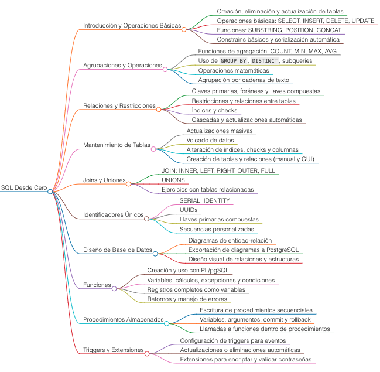

# Curso de PostgreSQL - SQL Desde Cero

## Tabla de Contenidos

1. [Introducción y Operaciones Básicas](#introducción-y-operaciones-básicas)
2. [Agrupaciones y Operaciones](#agrupaciones-y-operaciones)
3. [Relaciones y Restricciones](#relaciones-y-restricciones)
4. [Mantenimiento de Tablas](#mantenimiento-de-tablas)
5. [Joins y Uniones](#joins-y-uniones)
6. [Identificadores Únicos](#identificadores-únicos)
7. [Diseño de Base de Datos](#diseño-de-base-de-datos)
8. [Funciones](#funciones)
9. [Procedimientos Almacenados](#procedimientos-almacenados)
10. [Triggers y Extensiones](#triggers-y-extensiones)

---

## Introducción y Operaciones Básicas

- Creación, eliminación y actualización de tablas.
- Operaciones básicas como SELECT, INSERT, DELETE y UPDATE.
- Uso de funciones como SUBSTRING, POSITION, CONCAT y operadores básicos.
- Constrains básicos y serialización automática.

---

## Agrupaciones y Operaciones

- Funciones de agregación: COUNT, MIN, MAX, AVG.
- Uso de `GROUP BY`, `DISTINCT` y subqueries.
- Operaciones matemáticas y agrupación por cadenas de texto.

---

## Relaciones y Restricciones

- Introducción a claves primarias, foráneas y llaves compuestas.
- Restricciones y relaciones entre tablas.
- Índices y checks.
- Operaciones automáticas como cascadas y actualizaciones.

---

## Mantenimiento de Tablas

- Actualizaciones masivas y volcado de datos.
- Alteración de índices, checks y columnas.
- Creación de tablas y relaciones manualmente o mediante GUI.

---

## Joins y Uniones

- Diferentes tipos de JOIN: INNER, LEFT, RIGHT, OUTER, FULL.
- Uso de UNIONS.
- Ejercicios prácticos con múltiples tablas relacionadas.

---

## Identificadores Únicos

- Generación de identificadores únicos con SERIAL e IDENTITY.
- Uso de UUIDs y secuencias personalizadas.
- Creación de llaves primarias compuestas.

---

## Diseño de Base de Datos

- Creación de diagramas de entidad-relación.
- Exportación de diagramas a PostgreSQL.
- Diseño visual de relaciones y estructuras.

---

## Funciones

- Creación y uso de funciones con PL/pgSQL.
- Manejo de variables, cálculos, excepciones y condiciones.
- Uso de registros completos como variables.
- Retornos y manejo de errores.

---

## Procedimientos Almacenados

- Escribir procedimientos almacenados para ejecutar tareas secuenciales.
- Uso de variables, argumentos, commit y rollback.
- Llamadas a funciones dentro de procedimientos.

---

## Triggers y Extensiones

- Disparar funciones o procedimientos cuando ocurren eventos específicos.
- Configuración de triggers para actualizaciones o eliminaciones.
- Uso de extensiones para encriptar y validar contraseñas.

---
